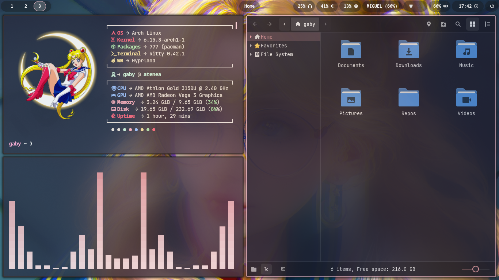
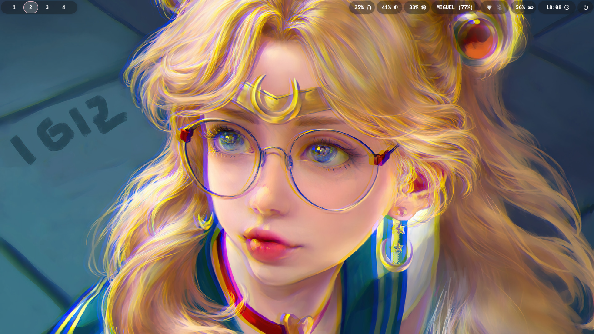

## 🌸 My Hyprland Dotfiles

It’s soft, cute, minimal, and perfect for everyday cozy hacking ✨

### 🧷 What’s in this rice?

- [Hyprland](https://github.com/hyprwm/Hyprland) for tiling (and vibes)
- [Kitty](https://github.com/kovidgoyal/kitty) as my pastel terminal
- GTK themes using [Catppuccin](https://github.com/catppuccin) (Maroon and Flamingo)
- Custom scripts for lock, clipboard, etc
- [Dunst](https://github.com/dunst-project/dunst) with translucent notifications
- Wallpapers featuring anime and magical girls
- Swappy for screenshots, Fastfetch for terminal flex

## 🖼️ Setup

### 🌸 Main workspace



### 🌙 Clean desktop



## 📦 Things I use

```ini
hyprland kitty waybar wofi dunst nemo
wlogout wlsunset swaylock-effects swappy  
catppuccin-gtk-theme catppuccin-cursors papirus-icon-theme  
pipewire wireplumber playerctl pamixer brightnessctl  
fastfetch rofimoji cava htop nerd-fonts  
```

## 🧚 If you want to use it

```bash
git clone https://github.com/flwergg/dotfiles.git
cd dotfiles
chmod +x install.sh 
./install.sh
```

### 💖 Credits & Inspiration

- r/unixporn & the amazing dotfiles community
- Artist who make Wallpapers
- All of mantainers of this amazing and opensource tools :3
