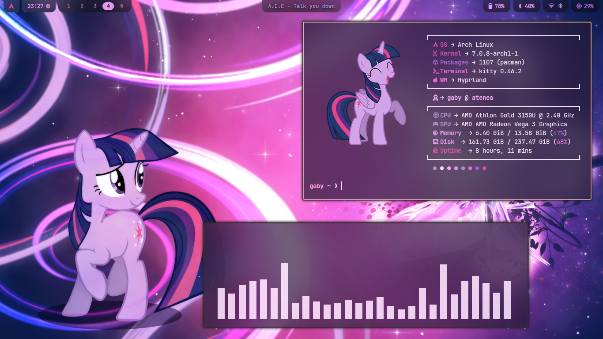
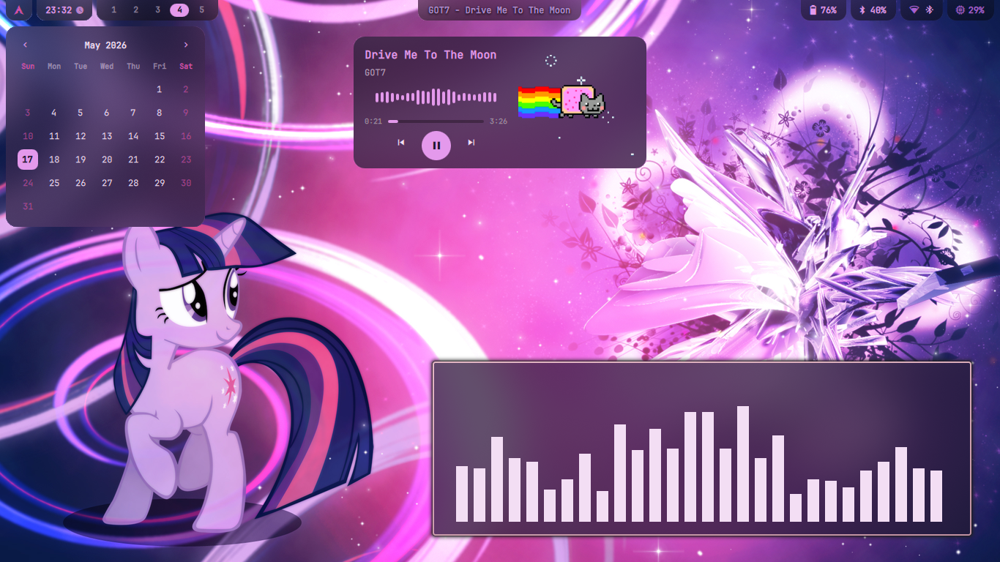

# 🌸 My Hyprland Dotfiles

It's soft, cute, minimal, and perfect for everyday cozy hacking ✨

---

## 🧷 What's in this rice?

- [Hyprland](https://github.com/hyprwm/Hyprland) for tiling (and vibes)
- [Quickshell](https://quickshell.outfoxxed.me/) — bar, launcher, clipboard, calendar, emoji picker, music panel, OSD
- [Kitty](https://github.com/kovidgoyal/kitty) as my pastel terminal
- [Swaync](https://github.com/ErikReider/SwayNotificationCenter) for notifications
- [pywal](https://github.com/dylanaraps/pywal) for reactive theming — colors update with every wallpaper change
- GTK themes using [Catppuccin](https://github.com/catppuccin) (Mocha Flamingo)
- Wallpapers featuring anime and magical girls
- Swappy for screenshots, Fastfetch for terminal flex ✨

---

## 🖼️ Setup

### 🌸 Main workspace




### 🌙 Clean desktop


---

## ✨ Quickshell panels

| Panel                           | Shortcut            |
| ------------------------------- | ------------------- |
| App launcher + wallpaper picker | `Super + R`         |
| Music player                    | `Super + Shift + S` |
| Clipboard                       | `Super + H`         |
| Emoji + Kaomoji                 | `Super + O`         |
| Calendar                        | click on clock      |
| Wifi / Bluetooth                | click on bar icons  |
| Volume + brightness OSD         | media keys          |

---

## 📦 Things I use

```ini
hyprland quickshell kitty swaync awww
swaylock-effects cava mpd playerctl
cliphist wlsunset swappy nemo
catppuccin-gtk-theme catppuccin-cursors papirus-icon-theme
pipewire wireplumber brightnessctl
fastfetch pywal ttf-jetbrains-mono-nerd
```

---

## 🧚 If you want to use it

```bash
git clone https://github.com/flwergg/dotfiles.git
cd dotfiles
chmod +x install.sh
./install.sh
```

> After running the script, add your gif to `~/.config/quickshell/assets/gifs/current.gif` and your wallpapers to `~/Pictures/Fonditos/`

---

## 💖 Credits & Inspiration

- [Harman1307](https://github.com/Harman1307/dotfiles-Hyprland) — Quickshell base and panel structure
- [dhrruvsharma](https://github.com/dhrruvsharma/shell) — emoji/kaomoji data and panel inspiration
- [doannc2212](https://github.com/doannc2212/quickshell-config) — OSD and module architecture inspiration
- r/unixporn and the amazing dotfiles community
- Artist who make Wallpapers
- All maintainers of these amazing open source tools :3
